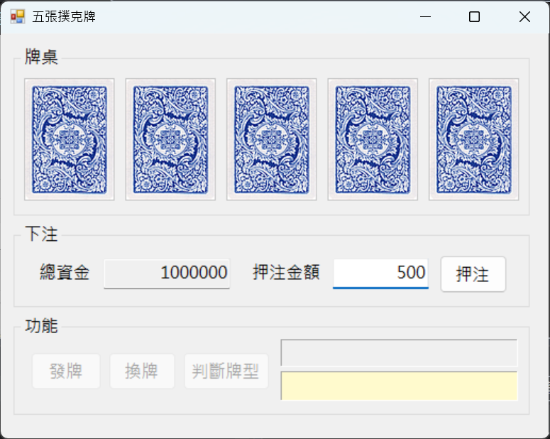
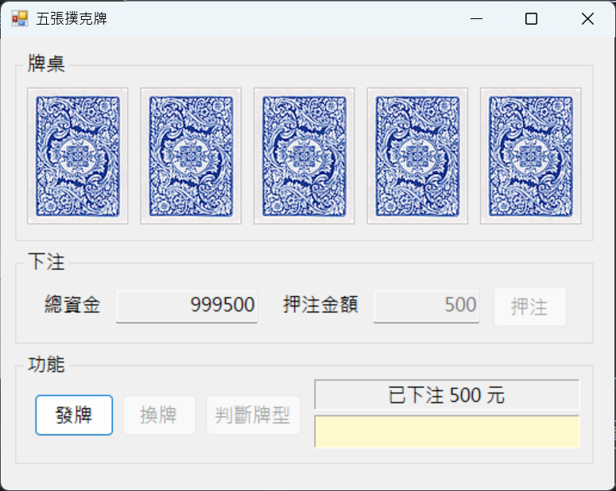
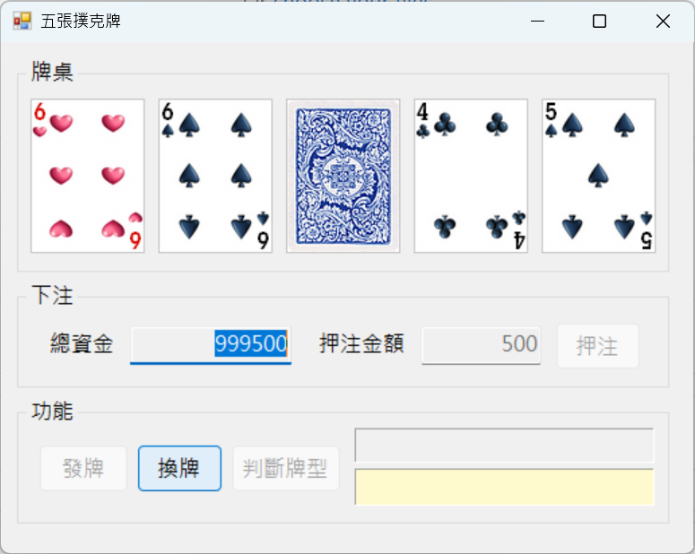
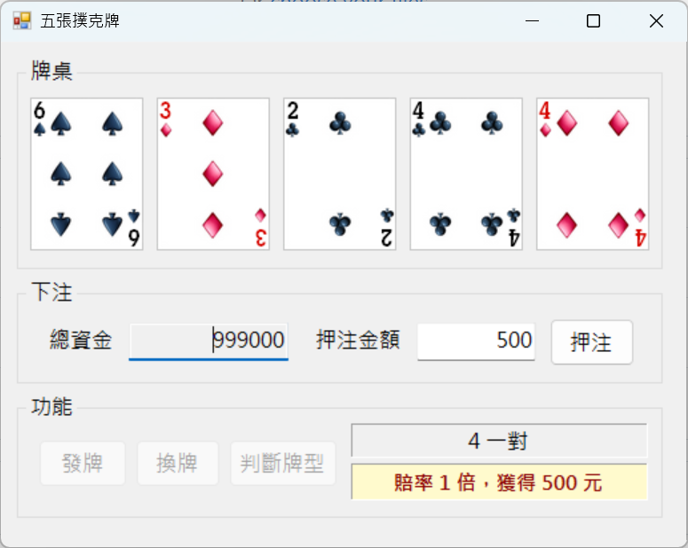
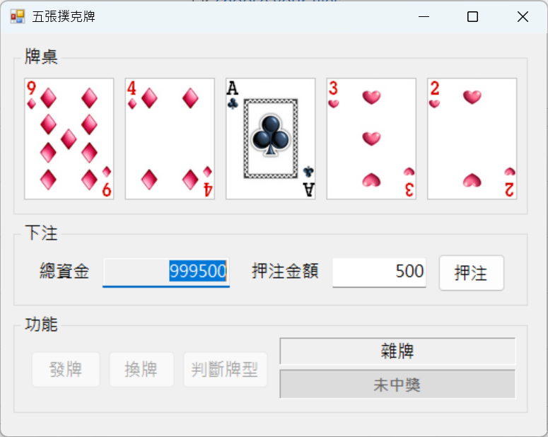
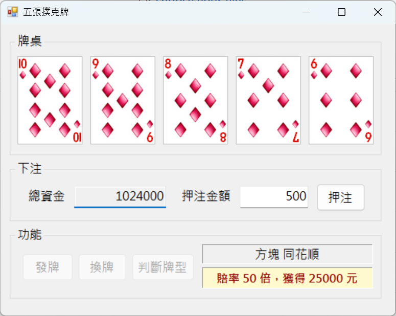

# 五張撲克牌下注遊戲

這是一個使用 **C# Windows Forms** 製作的五張撲克牌小遊戲。玩家可先輸入押注金額，再進行發牌、換牌、判斷牌型與派彩結算，並依照不同牌型賠率計算中獎金額。

## 專案簡介

本專案模擬簡易的五張撲克牌下注玩法，提供下注、發牌、換牌、牌型判斷與獎金計算等功能。  
玩家每局開始前可設定押注金額，系統會先扣除押注金額，再依據最終牌型與對應賠率計算中獎金額，並更新總資金。  
此外，專案也加入快捷鍵測試功能，方便快速驗證特定牌型與派彩結果。

## 開發環境

- Language: C#
- Framework: Windows Forms
- IDE: Visual Studio

## 功能說明

### 1. 初始畫面與下注功能

預設總資金為 1000000，可填寫押注金額。

按下押注後，顯示押注金額且更新總資金面額，接著可按下發牌。

### 2. 發牌與換牌功能

發牌後可選擇要換的牌，且每局只能換牌一次。

### 3. 牌型判斷與中獎顯示

換牌後按下判斷牌型，系統會顯示牌型與中獎金額。  
若中獎，結果區以黃底紅字顯示，並將中獎金額加回總資金。

若無中獎，結果區以灰底顯示，並扣除本局押注金額。

### 4. 快捷鍵測試功能

在發牌後，可使用快捷鍵快速測試指定牌型：

- `q`：同花大順
- `w`：同花順
- `e`：同花
- `r`：鐵支
- `t`：葫蘆
- `y`：三條

此功能可用來快速驗證牌型判斷、賠率計算與中獎結果是否正確。

## 賠率說明

本專案依照牌型給予對應賠率：

- 同花大順：250 倍
- 同花順：50 倍
- 鐵支：25 倍
- 葫蘆：9 倍
- 同花：6 倍
- 順子：4 倍
- 三條：3 倍
- 兩對：2 倍
- 一對：1 倍
- 雜牌：0 倍

## 操作流程

1. 輸入押注金額並按下「押注」。
2. 按下「發牌」取得五張牌。
3. 點選想要更換的牌，再按下「換牌」。
4. 按下「判斷牌型」查看結果。
5. 系統依牌型計算中獎金額並更新總資金。

## 專案特色

- 使用 Windows Forms 製作圖形化介面
- 支援下注與總資金更新
- 支援單次換牌機制
- 可依牌型自動判斷並計算派彩
- 以不同顏色顯示中獎與未中獎狀態
- 提供快捷鍵快速測試指定牌型
